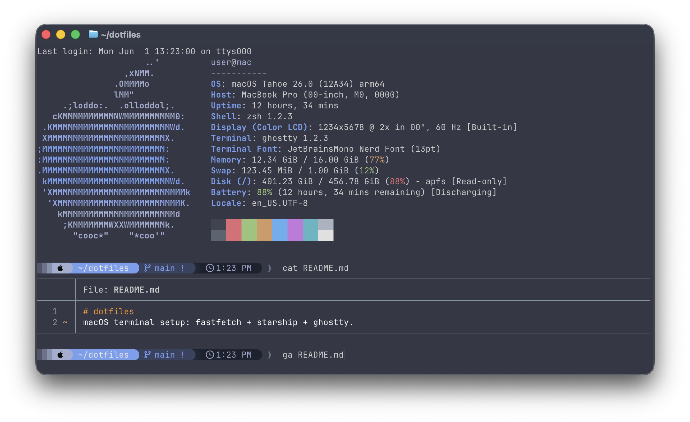
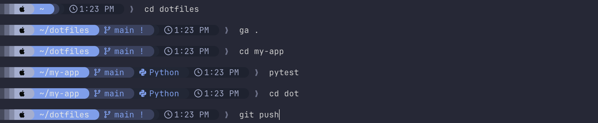

# Affaan's dotfiles

<p align="center">
  
</p>

My macOS terminal setup using Ghostty, Starship, Fastfetch, and some CLI tools.

> [!CAUTION]
> Personal config files.
> Read what each one does and take only the parts you want.
> Don't run configs you haven't read.
> Use at your own risk.

## Files

| File | Installs to | What it is |
| ---- | ----------- | ---------- |
| `zshrc` | `~/.zshrc` (merge, don't overwrite) | Shell config |
| `starship.toml` | `~/.config/starship.toml` | Single-line prompt |
| `config.ghostty` | `~/.config/ghostty/config` | Ghostty terminal config |
| `config.jsonc` | `~/.config/fastfetch/config.jsonc` | Fastfetch system-info layout |
| `statusline-command.sh` | `~/.claude/statusline-command.sh` | Tokyo Night Claude Code status line (macOS/Linux) |
| `statusline-command.ps1` | `%USERPROFILE%\.claude\statusline-command.ps1` | Tokyo Night Claude Code status line (Windows) |
| `gitconfig` | `~/.config/git/delta.gitconfig` (include from `~/.gitconfig`) | delta git diff pager |
| `nanorc` | `~/.nanorc` | GNU nano config |

> [!WARNING]
> Overwriting your `~/.zshrc` loses your current PATH, aliases, and shell config.  
> Merge the blocks you want into your existing one. Don't overwrite!

## Tools

Tools this setup uses.
`make tools` (non-Windows) installs them (except Ghostty, Git, and jq) (see [Installation](#installation)).

> [!IMPORTANT]
> If the `fzf` installer offers to edit your shell config, say `no`.
> Your `~/.zshrc` aliases `nvm` to `fnm`, so set the default Node version with `nvm default <version>`, not the old `nvm alias default`.  
> Turn `btop`'s theme background off (`theme_background = False`).

| Tool | Purpose |
| ---- | ------- |
| [Ghostty](https://ghostty.org) | Terminal |
| [Starship](https://starship.rs) | Prompt |
| [Fastfetch](https://github.com/fastfetch-cli/fastfetch) | System info on launch |
| [bat](https://github.com/sharkdp/bat) | `cat` with highlighting |
| [fd](https://github.com/sharkdp/fd) | `find` replacement |
| [ripgrep](https://github.com/BurntSushi/ripgrep) | `grep` replacement |
| [eza](https://github.com/eza-community/eza) | `ls` replacement |
| [tealdeer](https://github.com/tealdeer-rs/tealdeer) | Example-first `man` pages (`tldr`) |
| [htop](https://github.com/htop-dev/htop) | `top` replacement |
| [bottom](https://github.com/ClementTsang/bottom) | Graphed system monitor (`btm`) |
| [btop](https://github.com/aristocratos/btop) | Full-screen resource monitor |
| [jq](https://github.com/jqlang/jq) | JSON processor - usually pre-installed on macOS |
| [fzf](https://github.com/junegunn/fzf) | Fuzzy finder |
| [zoxide](https://github.com/ajeetdsouza/zoxide) | Smarter `cd` |
| [fnm](https://github.com/Schniz/fnm) | Node version manager |
| [Git](https://git-scm.com) | Version control - usually pre-installed on macOS |
| [delta](https://github.com/dandavison/delta) | Syntax-highlighting git diff pager |
| [nano](https://nano-editor.org) | Editor (real GNU nano) |
| [carapace](https://github.com/carapace-sh/carapace-bin) | Completion engine |
| [zsh-completions](https://github.com/zsh-users/zsh-completions) | Extra completion definitions |
| [fzf-tab](https://github.com/Aloxaf/fzf-tab) | fzf-powered tab-completion menu (`make fzf-tab`) |

## Fonts

- `starship.toml` and `statusline-command.sh` contain raw Nerd Font characters (powerline separators, icons).
  Copy the files directly; retyping or pasting from rendered text will break the glyphs.
- You'll need a [Nerd Font](https://www.nerdfonts.com) installed and selected in your terminal (I use `JetBrains Mono`).

## Installation

> [!NOTE]
> The steps below assume a macOS setup.
> On Windows the only applicable file is `statusline-command.ps1` (the Claude Code status line); see [Windows](#windows).
> The shell, terminal configs, and installer are macOS-only.

1. Install a Nerd Font (see [Fonts](#fonts)).

2. Clone the repo:

   ```sh
   git clone https://github.com/affaan-git/dotfiles.git
   cd dotfiles
   ```

   > Pick somewhere permanent as step 5 symlinks into this folder.

3. Install the prerequisites (for `make tools`):

   - **Xcode Command Line Tools** - `xcode-select --install`
   - **Rust** - [rustup.rs](https://rustup.rs) (eza)
   - **Ghostty** - [ghostty.org](https://ghostty.org)

   `git` and `jq` are included with recent macOS and the Command Line Tools.
   On older macOS install `jq` first.

4. Install the [tools](#tools):

   ```sh
   make tools
   ```

   > Tools are built from source or fetched from each project's latest release and checksum-verified.
   > Run `make update` any time to refresh them all to their latest versions.
   > `make` on its own lists every target.

5. Link the configs into place (existing files are backed up first):

   ```sh
   make link
   ```

   > **Keep the folder in place!** These are symlinks. Deleting or moving it breaks the links.  
   > `make unlink` removes them. To relocate, move the folder then re-run `make link`.

6. Merge the `zshrc` blocks you want into your own - it is not linked automatically (`make zsh` prints the steps).

7. Add the [status line](#statusline-command) config key to your settings.

## Colors

This setup uses two color palettes: an accent (blue/silver) for the Starship prompt, Fastfetch, and the status line, and a One Dark theme for the terminal (Ghostty) and fzf.
The tools can't cleanly share variables, so each palette's values are repeated across their configs.
[`PALETTE.md`](PALETTE.md) lists every color once and maps where each copy lives, so re-theming is easier.

## Config notes

### `starship.toml`



- Muted gray caret, no red on failure
- Generous command/scan timeouts so slow git/filesystem modules aren't cut off

### `config.ghostty`

- 120x30 window, background blur, One Dark palette
- Opens at `$HOME`, no state restoration between sessions
- Keeps the window open after a process exits

### `zshrc`

The tool overrides (`cat`->bat, `catp`->paged bat, `grep`->rg, `ls`->eza, fzf, zoxide, fastfetch, starship) are behind `if [[ -n "$RICH_TERM" || "$TERM_PROGRAM" == "ghostty" ]]`, so Terminal.app stays mostly stock.

Always-on: `setopt NO_NOMATCH`, bash-style word motions, PATH (`~/.local/bin`), fnm, `python`/`pip`->`python3`/`pip3`, `explorer`/`finder`, and git helpers:

- `gs` status, `gl` log, `glp` log with diffs, `ga` add, `grs` restore --staged
- `gr` restore and `grc` rm --cached prompt for confirmation first (they can lose work)
- `gd` - smart diff: bare `gd` = all changes; `gd <ref>`/`<range>` diffs that; `gd <path>` vs HEAD
- `NO_NOMATCH` keeps unmatched glob characters as literal text (e.g. `pip install requests[socks]`, URLs with `?`) instead of zsh erroring with "no matches found".
  A glob that matches nothing is passed through literally rather than stopping the command, so zsh won't catch a typo'd `rm *.foo` for you
- `select-word-style bash` makes word motions (`Ctrl-W`, `Alt-Backspace`, `Alt-B`/`F`) stop at `/` and punctuation, so they act on one path segment at a time instead of the whole `a/b/c/d`

All git diff output (including `gd`) renders through [delta](https://github.com/dandavison/delta), which `make link` enables via an include in your git config (see [Installation](#installation)).
The delta config enables mouse-wheel scrolling of the diff and `navigate = true` so `n` / `N` jump between changes, files, and commits.
Drag-to-select needs Shift+mouse-drag.

### `nanorc`

Config for GNU nano: syntax highlighting, soft-wrap, line numbers, position memory, and backup-on-save into `~/.cache/nano/backups`.
`tabstospaces` is off on purpose so tab-sensitive files (Makefiles) stay intact.

macOS adds `/usr/bin/nano` as a symlink to Pico - no highlighting, no UTF-8 - so this only takes effect with real GNU nano.
Use `make nano` for a self-contained binary build (see [`scripts/build-nano.sh`](scripts/build-nano.sh)).

### completions

`zshrc` loads enhanced tab completion in a fixed order (each piece is skipped if not installed): extra definitions from [zsh-completions](https://github.com/zsh-users/zsh-completions) join `fpath`, then `compinit`, then [fzf](https://github.com/junegunn/fzf), then [carapace](https://github.com/carapace-sh/carapace-bin), and finally [fzf-tab](https://github.com/Aloxaf/fzf-tab).
This replaces zsh's menu with an fzf picker and `eza` directory preview on `cd`.

Matching is case-insensitive, right-arrow accepts a directory and keeps completing, and `<` / `>` switch between match groups.

### `statusline-command`


Add to `~/.claude/settings.json` (merge this key, don't overwrite the file):

#### macOS/Linux

Needs `jq` and `git` on your PATH.

```json
{
  "statusLine": { "type": "command", "command": "bash ~/.claude/statusline-command.sh" }
}
```

#### Windows

Parses JSON natively, so no `jq`

> [!NOTE]
> Write the literal path in the `command`. `%USERPROFILE%` doesn't expand there. Forward slashes avoid escaping backslashes in JSON.

```json
{
  "statusLine": { "type": "command", "command": "powershell -NoProfile -File C:/Users/<you>/.claude/statusline-command.ps1" }
}
```

Restart Claude Code after editing `settings.json`.

---

All product names, logos, and trademarks are property of their respective owners.
